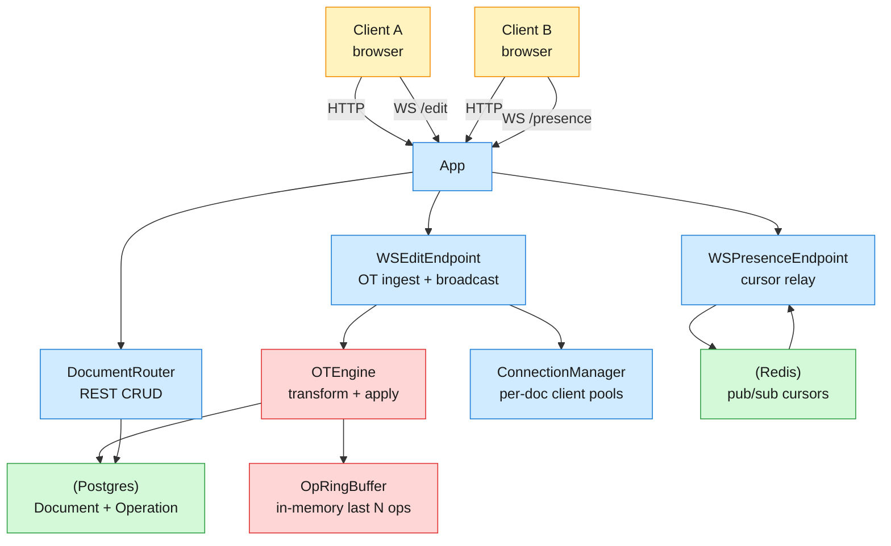
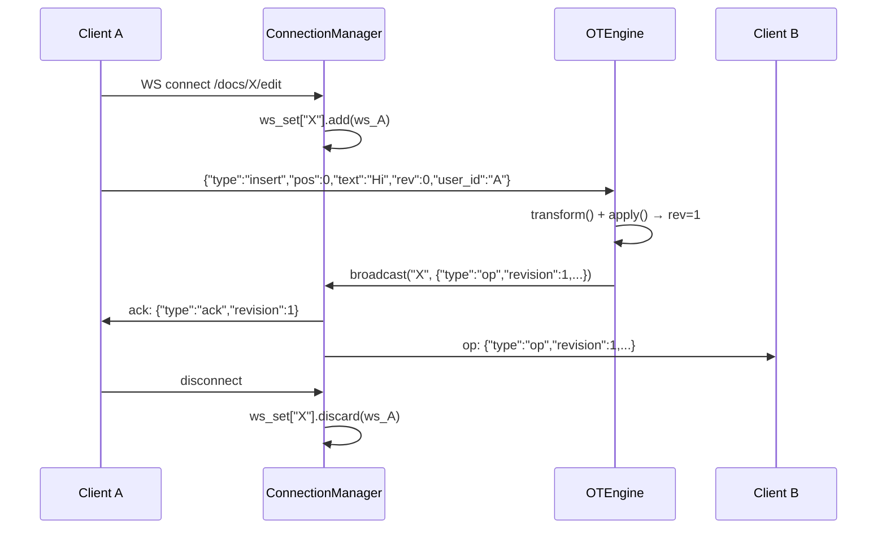

# Google Docs MVP — Design

Concrete design for the MVP cut defined in `docs/mvp-scope.md`. Full target: `docs/system-design.md`.
Package: `googledocs`. Stack: Python 3.12 · FastAPI · PostgreSQL 16 · Redis 7 · SQLAlchemy async · Alembic.

---

## 1. Requirements

### Functional (MVP)
- FR1: Create, open, rename, soft-delete documents via REST
- FR2: Concurrent real-time text editing via WebSocket (Jupiter OT, single server)
- FR3: Live cursor presence via WebSocket + Redis pub/sub
- FR4: Causal ordering via server-assigned monotonic revision numbers

### Non-functional
- NFR1: Sub-100ms end-to-end latency for edit ops (from receive to broadcast)
- NFR2: Strictly monotonic revision per document (no gaps, no reuse)
- NFR3: OT transform is deterministic and commutative for concurrent same-position inserts
- NFR4: Presence updates propagate within 1s for connected clients

### Out of scope
Rich text formatting, images/tables/comments, version history/restore, auth/user management, horizontal scaling, offline editing.

---

## 2. Back of the envelope

- **Edit throughput:** 1M DAU × 5 docs × 30 edits/min → ~42K writes/sec → single-server async Python handles ~5K–10K edits/sec comfortably; MVP target is 100 concurrent editors, not 1M DAU
- **Operation storage:** ~120 bytes/op (uuid, doc_id, user_id, type, pos, text, revision, ts) × 10K ops/doc → ~1.2 MB/document max → Postgres handles easily
- **Ring buffer memory:** 500 ops × 120 bytes × 100 active docs → ~6 MB in-process → negligible

---

## 3. Data model

```sql
Document {
  id:         uuid PK DEFAULT gen_random_uuid()
  title:      text NOT NULL
  content:    text NOT NULL DEFAULT ''    ← canonical text; recomputed from ops on read
  revision:   int NOT NULL DEFAULT 0      ← server-assigned monotonic per-doc
  created_at: timestamptz NOT NULL DEFAULT now()
  updated_at: timestamptz NOT NULL DEFAULT now()
  deleted_at: timestamptz                 ← soft delete (NULL = active)
}

Operation {
  id:          uuid PK DEFAULT gen_random_uuid()
  document_id: uuid NOT NULL FK → Document(id) ON DELETE CASCADE
  user_id:     text NOT NULL              ← string for MVP (no auth system)
  type:        text NOT NULL CHECK (type IN ('insert', 'delete'))
  position:    int NOT NULL               ← character offset in base revision
  text:        text                       ← inserted text (NULL for delete)
  length:      int                        ← deleted length (NULL for insert)
  revision:    int NOT NULL               ← server-assigned causal order
  created_at:  timestamptz NOT NULL DEFAULT now()
}

INDEX uk_document_revision ON Operation(document_id, revision) UNIQUE
INDEX ix_operation_document_revision ON Operation(document_id, revision)
```

- `Document.content` is the canonical text, **recomputed from ops** when reading. This is the source of truth for `GET /docs/{id}`.
- `Operation.revision` is strictly monotonic per document — enforced by the unique index + server-side increment.
- No User entity in MVP — `user_id` is an opaque string passed by clients.

---

## 4. API

- `POST /docs` — create document; body `{title: str}`; returns `201 {id, title, content: "", revision: 0, created_at, updated_at}`
- `GET /docs/{id}` — get document; returns `200 {id, title, content, revision, created_at, updated_at}` or `404`
- `PATCH /docs/{id}` — rename document; body `{title: str}`; returns `200 {id, title, content, revision, ...}` or `404`
- `DELETE /docs/{id}` — soft delete; returns `204` (idempotent — second delete also `204`); unknown id `404`
- `WS /docs/{id}/edit` — Jupiter OT editing session (see §5.1)
- `WS /docs/{id}/presence` — cursor position broadcast via Redis pub/sub (see §5.2)
- `GET /healthz` — liveness probe; returns `200 {"status": "ok"}`

### WebSocket message contracts

**Edit session (`WS /docs/{id}/edit`):**

Client → Server:
```json
{"type": "insert", "position": 0, "text": "Hello", "rev": 0, "user_id": "alice"}
{"type": "delete", "position": 5, "length": 3, "rev": 1, "user_id": "alice"}
```

Server → Client (broadcast to ALL, including sender):
```json
{"type": "ack", "revision": 1, "original": {"position": 0, "text": "Hello"}}
{"type": "op", "revision": 2, "type": "insert", "position": 5, "text": " World", "user_id": "bob"}
{"type": "error", "code": "STALE_REVISION", "message": "Client rev 0 is behind. Reload document."}
```

**Presence session (`WS /docs/{id}/presence`):**

Client → Server:
```json
{"type": "cursor", "position": 42, "user_id": "alice", "user_name": "Alice"}
```

Server → Client (broadcast via Redis pub/sub to all subscribers):
```json
{"type": "presence", "cursors": {"alice": {"position": 42, "user_name": "Alice", "ts": 1719792000}, "bob": {"position": 17, ...}}}
```

---

## 5. High-Level Design



**Request flow (edit):**
1. Client sends op via WS → `WSEditEndpoint` validates + extracts `{doc_id, type, position, text/length, rev, user_id}`
2. `OTEngine.transform(client_op)` — transforms against concurrent ops in `OpRingBuffer` with same base `rev`
3. `OTEngine.apply(transformed_op)` — appends to `content`, persists `Operation` row, bumps `Document.revision`
4. `ConnectionManager.broadcast(doc_id, transformed_op)` — sends `{"type": "op", ...}` to all connected clients
5. Sender receives `{"type": "ack", "revision": N, ...}` confirming their op was applied

---

## 6. Deep dives

### DD1: Jupiter OT engine — transform rules + in-memory buffer

**Problem.** Two clients insert at position 5 concurrently (both base rev=10). Without transformation, both ops apply at position 5 and text overlaps. The server must detect the conflict and shift one op's position so both inserts appear correctly.

**Approach 1: Last-write-wins (no transform).**
Accept ops in arrival order and apply as-is.
- **Pro:** Trivially simple. No transform logic.
- **Con:** Concurrent same-position inserts overwrite each other — one client's text disappears. Violates FR2.

**Approach 2: Full OT with 4-way transform matrix.**
Transform every op against every concurrent op in the buffer. Four rules: insert-insert, insert-delete, delete-insert, delete-delete.
- **Pro:** Correct for all op types. Standard Jupiter protocol — well-documented, proven (Google Docs, Etherpad).
- **Con:** Must buffer concurrent ops; clients behind by >N ops must reload. Transform logic is tricky to get right.

**Approach 3: CRDT (Conflict-free Replicated Data Type).**
Assign each character a unique position (fractional index, e.g., `[5, "clientA_uuid"]`). Inserts don't conflict.
- **Pro:** No server-side transform needed. Natural for P2P.
- **Con:** Tombstone management for deletes. Interleaving characters from different clients can look weird without post-processing. More complex client logic.

**Decision:** Approach 2 (Jupiter OT, 4-rule matrix). Single server = single arbiter of revision numbers. The protocol is well-understood and maps directly to the full design's OT model.

**Rationale:** Etherpad (open-source Google Docs-like) uses the same approach. Single-server OT is the standard answer for collaborative editing at MVP scale — it has the fewest corner cases. CRDTs shine in P2P/decentralized settings which are out of scope for this MVP.

💡 **Transform rules (the 4 combos):**

```
insert(a) vs insert(b):
  if a.pos < b.pos → no change (a is before b)
  if a.pos >= b.pos → shift b.pos right by len(a.text)
  if a.pos == b.pos → server-arrival order decides tiebreak; second op shifts

insert(a) vs delete(b):
  if a.pos <= b.pos → shift b.pos right by len(a.text)
  else → shift a.pos left by b.length

delete(a) vs insert(b):
  symmetric to above

delete(a) vs delete(b):
  if a range starts before b → truncate b if overlapping
  if identical range → drop b (already deleted)
```

**In-memory ring buffer (`OpRingBuffer`):**
- Fixed-size `collections.deque(maxlen=500)` per document, stored in `dict[doc_id, deque]`
- On each new op: push to deque; if full, oldest op falls off
- On client connecting with `rev=N`: if N < oldest buffer rev, reject with `STALE_REVISION` — client must `GET /docs/{id}` to reload full state
- Thread safety: `asyncio.Lock` per document (not per op) — the lock is held for transform + apply + persist (~1ms typical)

**Edge cases:**
- Client sends `rev=0` (first op): no concurrent ops to transform against. Direct apply.
- Client reconnects mid-session: sends last known rev; if still in buffer, resume; if too old, force reload.
- Transform produces zero-length insert (deleted concurrently): drop the op, ack with no-op revision.
- Delete at position beyond content length: clamp to end, delete nothing. Log a warning.

### DD2: WebSocket connection manager — per-doc pools + broadcast

**Problem.** Multiple clients connect to the same document. The server must track which clients are on which document and broadcast ops/presence to the right subset without O(N²) fan-out logic.

**Decision:** A `ConnectionManager` singleton that maintains `dict[doc_id, set[WebSocket]]`. On connect: add to set. On disconnect: remove. Broadcast: iterate set, `send_json()` with timeout.



**Edge cases:**
- Client disconnects during broadcast: catch `WebSocketDisconnect`, remove from set, continue to next client.
- Empty doc set (last client leaves): remove entry from dict (prevents memory leak).
- Broadcast timeout (one slow client): use `asyncio.wait_for(send, timeout=5)`, skip on timeout.

### DD3: Redis pub/sub for cursor presence

**Problem.** Cursor positions must be visible to all collaborators in near-real-time. Unlike edit ops, cursors are ephemeral — losing them on restart is acceptable for MVP.

**Approach 1: In-memory dict + broadcast via ConnectionManager.**
Store `dict[doc_id, dict[user_id, {position, ts}]]` in-process, broadcast to all connected WS clients.
- **Pro:** No Redis dependency. Same broadcast mechanism as edit ops.
- **Con:** Only works for single process. Lost on restart. No reuse if we scale to multiple servers.

**Approach 2: Redis pub/sub per document.**
Each `WS /docs/{id}/presence` connection subscribes to `presence:{doc_id}` channel. On cursor update: `PUBLISH presence:{doc_id} <json>`. All subscribers receive it.
- **Pro:** Decouples presence from the app process. Survives app restart (Redis persists subscriptions). Naturally extends to multi-server (all servers subscribe to same channel).
- **Con:** Requires Redis. Pub/sub is fire-and-forget — no persistence; late joiners don't see existing cursors (fix: send full state on join, then subscribe for deltas).

**Decision:** Approach 2 (Redis pub/sub). The MVP spec requires Redis anyway (for future scaling). Pub/sub is the simplest presence primitive.

**Protocol:**
1. Client connects to `WS /docs/{id}/presence`
2. Server sends current presence snapshot: `{"type": "presence", "cursors": {...}}`
3. Server subscribes to Redis channel `presence:{doc_id}`
4. On cursor message from client: `PUBLISH presence:{doc_id} {json}` with cursor data
5. On Redis message received: forward to ALL connected WS clients for that document
6. On disconnect: `PUBLISH presence:{doc_id} {type: "leave", user_id: ...}`

**Edge cases:**
- Redis unavailable: log warning, presence becomes no-op (editing still works).
- Late joiner: gets initial snapshot from in-memory state, then subscribes for deltas.
- Stale cursors: a 30s TTL sweep removes cursors with `ts < now - 30s` from the snapshot. Not published as a "leave" event — just silently dropped.

---

## 7. Trade-offs & decisions

| Decision | Choice | Rationale |
|---|---|---|
| OT protocol | Jupiter (single-server) | Simplest causality model; no vector clocks. Proven in Etherpad, early Google Docs. |
| Content storage | Recomputed from ops on read | Ops are the source of truth; content is derived. Enables future rich text (per-op delta storage). |
| Per-doc lock | `asyncio.Lock` per document_id | Only one writer per document at a time; ops are serialized per-doc naturally. No deadlock risk. |
| Op buffer size | 500 ops (ring buffer) | 500 ops × 120B × 100 docs = 6 MB. Large enough for 99% of reconnects; behind clients reload from DB. |
| Presence transport | Redis pub/sub | Decouples from app process; survives app restart; reusable for multi-server. |
| Soft delete | `deleted_at` timestamp | Fast, reversible; no data loss. Storage grows — acceptable for MVP (future: async compaction). |
| No auth | `user_id` string | MVP scope; add JWT/OAuth in later phase without changing the editing protocol. |
| Plain text only | `content` is a text column | Simplest CRUD; rich text adds no new architecture — ops already carry per-char metadata. |
| HTTP client for tests | `httpx` with `AsyncClient` | Standard async HTTP client; works with `pytest-asyncio`. No app imports — true black-box. |

---

## 8. Module layout

```
sd-google-docs-backend-mvp-v2026.07.02.2/
├── design.md                          ← this file
├── README.md                          ← filled by writer
├── AGENTS.md                          ← kanban-worker rules (already present)
├── KICKOFF.md                         ← build launch guide (already present)
├── pyproject.toml                     ← deps + dev extras
├── .env.example                       ← env vars documented, safe defaults
├── .gitignore
├── Dockerfile                         ← multi-stage, python:3.12-slim
├── docker-compose.yml                 ← db + redis + app; APP_PORT override
├── alembic.ini
├── alembic/
│   ├── env.py
│   └── versions/
│       └── 001_initial.py             ← Document + Operation tables
├── docs/
│   ├── system-design.md               ← full target design (already present)
│   └── mvp-scope.md                   ← MVP contract (already present)
├── src/googledocs/
│   ├── __init__.py
│   ├── main.py                        ← app factory create_app() + lifespan + /healthz
│   ├── config.py                      ← pydantic-settings (DB URL, Redis URL, port)
│   ├── database.py                    ← async engine + session factory + get_session dependency
│   ├── redis.py                       ← Redis client factory + get_redis dependency
│   ├── models/
│   │   ├── __init__.py
│   │   ├── document.py                ← Document ORM model (SQLAlchemy)
│   │   └── operation.py               ← Operation ORM model
│   ├── schemas/
│   │   ├── __init__.py
│   │   ├── document.py                ← DocumentCreate, DocumentUpdate, DocumentResponse
│   │   └── operation.py               ← OperationIn (WS msg), OperationOut (broadcast)
│   ├── routers/
│   │   ├── __init__.py
│   │   ├── health.py                  ← GET /healthz
│   │   ├── documents.py               ← POST/GET/PATCH/DELETE /docs, /docs/{id}
│   │   ├── ws_edit.py                 ← WS /docs/{id}/edit (OT editing)
│   │   └── ws_presence.py             ← WS /docs/{id}/presence (cursor relay)
│   ├── services/
│   │   ├── __init__.py
│   │   ├── document.py                ← DocumentService: CRUD + soft delete
│   │   ├── ot_engine.py               ← OTEngine: transform() + apply() + OpRingBuffer
│   │   ├── connection_manager.py      ← ConnectionManager: per-doc WS pools + broadcast
│   │   └── presence.py                ← PresenceService: Redis pub/sub + snapshot
│   └── ot/
│       ├── __init__.py
│       └── transforms.py              ← pure functions: insert_insert, insert_delete, delete_insert, delete_delete
├── tests/                             ← WHITE-BOX unit tests (import googledocs.*)
│   ├── conftest.py
│   ├── test_document_service.py
│   ├── test_ot_transforms.py
│   ├── test_ot_engine.py
│   └── test_connection_manager.py
└── verify/                            ← BLACK-BOX acceptance tests (HTTP/WS only, no app imports)
    ├── manifest.env
    └── acceptance/
        ├── conftest.py                ← shared fixtures: API_BASE_URL, create_doc helper
        ├── test_fr1_crud.py
        ├── test_fr2_ot_editing.py
        ├── test_fr3_cursor_presence.py
        └── test_fr4_causal_ordering.py
```

**Layering discipline (hard):**
- `routers/` — HTTP/WS parsing only; call `services/`, return responses. Never touch the DB directly.
- `services/` — business logic + data access. `DocumentService` reads/writes via `database.get_session`.
- `models/` — SQLAlchemy ORM classes. No business logic.
- `schemas/` — Pydantic DTOs. Wire format for REST and WS messages.
- `ot/` — pure transform functions (no DB, no I/O). Unit-testable in isolation.

---

## 9. Implementation tasks (build breakdown)

Each task is a kanban card for the build phase. Tagged with the appropriate engineer tier.

### Task 1: Project scaffold + config
**Tier: senior-engineer**
- `pyproject.toml` with deps: fastapi, uvicorn, sqlalchemy[asyncio], asyncpg, alembic, redis, websockets, pydantic-settings, httpx
- `.env.example`, `.gitignore`
- `src/googledocs/config.py` — `Settings(BaseSettings)` with DB_URL, REDIS_URL, APP_PORT
- `src/googledocs/main.py` — `create_app()`, lifespan (connect DB + Redis), `GET /healthz`
- `src/googledocs/database.py` — async engine, `async_session`, `get_session` dependency
- `src/googledocs/redis.py` — Redis client factory, `get_redis` dependency

### Task 2: Data model + Alembic migrations
**Tier: staff-engineer** — schema correctness is critical; index on `(document_id, revision)` is unique constraint that enforces causal ordering
- `src/googledocs/models/document.py` — `Document` ORM model
- `src/googledocs/models/operation.py` — `Operation` ORM model with CHECK constraint on `type`
- `alembic init` + `alembic/versions/001_initial.py` — creates both tables + unique index
- `alembic/env.py` — imports app models, targets metadata

### Task 3: Document CRUD (REST layer)
**Tier: senior-engineer**
- `src/googledocs/schemas/document.py` — `DocumentCreate`, `DocumentUpdate`, `DocumentResponse`
- `src/googledocs/services/document.py` — `DocumentService`: create, get, update, soft-delete, get_content (recomputed from ops)
- `src/googledocs/routers/documents.py` — `POST /docs`, `GET /docs/{id}`, `PATCH /docs/{id}`, `DELETE /docs/{id}`
- Error handling: 404 for unknown id, 204 idempotent delete

### Task 4: OT engine core — transform() + revision tracking
**Tier: staff-engineer** — correctness-critical: transform must be deterministic, commutative for same-position inserts, and never produce invalid positions
- `src/googledocs/ot/transforms.py` — pure functions: `insert_insert(a, b)`, `insert_delete(a, b)`, `delete_insert(a, b)`, `delete_delete(a, b)`
- Return type: `(Operation, Operation?)` — second op may be None if absorbed
- No DB access, no I/O — unit-testable in isolation

### Task 5: OT operation buffer — thread-safe ring buffer
**Tier: staff-engineer** — per-doc locking is the concurrency spine; lock lifecycle bugs cause dead ops or lost writes
- `src/googledocs/services/ot_engine.py` — `OTEngine` class:
  - `OpRingBuffer` — `dict[doc_id, deque(maxlen=500)]` with `asyncio.Lock` per doc
  - `transform(client_op)` — fetches concurrent ops from buffer, applies transform rules
  - `apply(transformed_op)` — updates `Document.content`, persists `Operation` row, bumps `Document.revision`
  - `get_concurrent_ops(doc_id, base_rev)` — returns ops in buffer with `rev > base_rev`

### Task 6: WebSocket edit endpoint
**Tier: senior-engineer**
- `src/googledocs/routers/ws_edit.py` — `WS /docs/{id}/edit`:
  - Accept WS connection, register in `ConnectionManager`
  - On message: parse op JSON → validate fields → call `OTEngine.transform + apply` → broadcast
  - Send `{"type": "ack", "revision": N}` to sender
  - On disconnect: unregister
  - On `STALE_REVISION`: send error, close with 4000

### Task 7: WebSocket connection manager
**Tier: staff-engineer** — must handle concurrent connect/disconnect without races; broadcast timeout must not leak tasks
- `src/googledocs/services/connection_manager.py` — `ConnectionManager` singleton:
  - `connect(doc_id, ws)` — add to set
  - `disconnect(doc_id, ws)` — remove; clean up empty sets
  - `broadcast(doc_id, message)` — `asyncio.gather` with per-client `asyncio.wait_for`

### Task 8: Presence endpoint + Redis pub/sub
**Tier: senior-engineer**
- `src/googledocs/services/presence.py` — `PresenceService`:
  - `update_cursor(doc_id, user_id, position, user_name)` — in-memory dict + `PUBLISH presence:{doc_id}`
  - `get_snapshot(doc_id)` — current cursors (pruned of stale >30s)
  - `subscribe(doc_id)` — async Redis pub/sub listener
- `src/googledocs/routers/ws_presence.py` — `WS /docs/{id}/presence`:
  - On connect: send snapshot, subscribe to Redis channel
  - On message: `PUBLISH` cursor update
  - On disconnect: `PUBLISH` leave, unsubscribe

### Task 9: White-box unit tests
**Tier: senior-engineer**
- `tests/test_document_service.py` — CRUD operations, soft delete, idempotency
- `tests/test_ot_transforms.py` — all 4 transform combos, edge cases (identical position, overlapping deletes)
- `tests/test_ot_engine.py` — full transform + apply pipeline, revision monotonicity
- `tests/test_connection_manager.py` — connect/disconnect, broadcast, timeout handling
- `tests/conftest.py` — async test fixtures: test DB, Redis, app client

### Task 10: Acceptance tests (black-box)
**Tier: senior-engineer**
See `verify/acceptance/` files below — one per FR. These are black-box, HTTP/WS only, no app imports.

### Task 11: Docker + compose + deploy doc
**Tier: senior-engineer**
- Multi-stage `Dockerfile` (python:3.12-slim) with HEALTHCHECK
- `docker-compose.yml`: `db` (postgres:16), `redis` (redis:7), `app`; `APP_PORT` override; healthchecks on all
- `DEPLOY.md` with host run/teardown steps, first-run migration, env table

### Task 12: CI pipeline
**Tier: senior-engineer**
- `.github/workflows/ci.yml` — lint (ruff), test (pytest), docker build, e2e (start + acceptance + teardown)
- Schedule: on push + daily

---

## 10. Verification

All acceptance tests live under `verify/acceptance/` — one file per FR. Run with:
```bash
pytest verify/acceptance/ -v
```

Tests use `API_BASE_URL` env var (default: `http://localhost:8010`). No app imports — pure black-box HTTP/WebSocket calls via `httpx` and `websockets`.

| Suite | FR | What it verifies | Transport |
|---|---|---|---|
| `test_fr1_crud.py` | FR1 | Create → 201, Get → 200/404, Rename → 200, Delete → 204 (idempotent) | HTTP |
| `test_fr2_ot_editing.py` | FR2 | Two concurrent inserts at pos 0 → both appear in final content | WebSocket |
| `test_fr3_cursor_presence.py` | FR3 | Client A cursor update → Client B receives presence event | WebSocket |
| `test_fr4_causal_ordering.py` | FR4 | Five sequential inserts → strictly increasing revisions | WebSocket + HTTP |

See `docs/mvp-scope.md` → "Acceptance Criteria" for exact AC-1 through AC-4 assertions.
