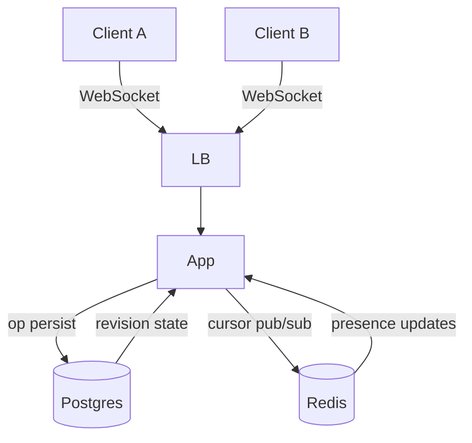

# Google Docs — System Design (target)

> Full design from the System Design Notion page. The MVP is the cut in `docs/mvp-scope.md`.

## 1. Requirements

**Functional:**
- FR1: Create, open, rename, delete documents (CRUD)
- FR2: Concurrent real-time text editing with conflict resolution
- FR3: Live cursor presence for all collaborators
- FR4: Version history with point-in-time restore
- FR5: Rich text formatting (bold, italic, headers, lists)
- FR6: Embedded images, tables, comments

**Non-functional:**
- NFR1: Sub-100ms latency for edits (editor feels real-time)
- NFR2: Causal ordering via server-assigned revision numbers
- NFR3: Eventually consistent across regions
- NFR4: 99.95% availability for the editing service

**Out of scope (future):**
- Offline editing with sync-on-reconnect
- Collaborative undo/redo across users

## 2. Back of the envelope

- 1M DAU × 5 docs opened/day × 30 edits/min = 2.5M write ops/min → ~42K writes/sec
- Average document: 50KB → 1M docs × 50KB = 50 GB storage
- OT transform cost: O(n) per character inserted → ~1ms for typical doc

## 3. Data model

```
Document
  id: uuid PK
  title: text
  content: text
  revision: int          ← monotonically increasing per-doc
  created_at: timestamp
  updated_at: timestamp
  deleted_at: timestamp?  ← soft delete

Operation
  id: uuid PK
  document_id: uuid FK → Document
  user_id: uuid
  type: enum(insert, delete)
  position: int           ← character offset
  text: text?             ← inserted text
  length: int?            ← deleted length
  revision: int           ← server-assigned causal order
  created_at: timestamp

User
  id: uuid PK
  name: text
  created_at: timestamp
```

## 4. API

- `POST /docs` — create document, returns `doc_id` and initial revision
- `GET /docs` — list user's documents (paginated)
- `GET /docs/{doc_id}` — get document metadata + full content at current revision
- `PATCH /docs/{doc_id}` — rename
- `DELETE /docs/{doc_id}` — soft delete (set deleted_at)
- `WS /docs/{doc_id}/edit` — OT editing session (Jupiter protocol)
- `WS /docs/{doc_id}/presence` — cursor position broadcast (Redis pub/sub)

## 5. Deep dive — OT & Concurrency

**Jupiter protocol (single-server OT):**
Client sends operations tagged with the last server revision they've seen `{type, position, text/length, rev}`. The server:
1. Accepts the op, assigns next monotonic revision
2. Transforms the op against any concurrent ops (same base revision, not yet ack'd to sender)
3. Persists the transformed op(s) as the canonical state
4. Broadcasts the transformed op to ALL clients (including sender) with the assigned revision

**Transform rules (4 combos):**
- insert(a) vs insert(b): if pos_a < pos_b, no change; if pos_a >= pos_b, shift pos_a right by len(b)
- insert vs delete: if insert.pos <= delete.pos, shift delete.pos right; else shift insert.pos left
- delete vs insert: symmetric to above
- delete(a) vs delete(b): if ranges overlap, truncate/remove the later op's range

**In-memory op buffer:** Per-document ring buffer of last N=500 ops for transform context. After N, buffer slides — clients behind by >N must full-reload from Postgres.

**Server-assigned ordering:** The single server is the sole arbiter of revision numbers (monotonic counter per document). No vector clocks needed — single writer simplifies causality.

## 6. Architecture



## 7. Trade-offs

| Decision | Pro | Con |
|---|---|---|
| Single server OT (Jupiter) | Simple causality, no vector clocks | No horizontal scale for write throughput |
| Soft delete only | Fast, reversible | Storage grows unbounded (future: async compaction) |
| Redis pub/sub for cursors | Low latency, built-in broadcast | Ephemeral — cursor lost on Redis restart |
| Plain text content in Postgres | Simple CRUD, no extra services | No rich formatting in MVP; future: per-op delta storage for rich text |

## 8. Open questions

- When should ops be compacted (apply to base text and discard)? Trade-off between fast replay and storage.
- Should cursor presence use Redis or a dedicated presence service for scale beyond single server?
- How should the client reconcile its local state after reconnect? Full reload or delta replay?
